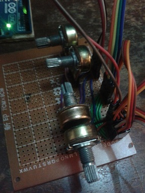
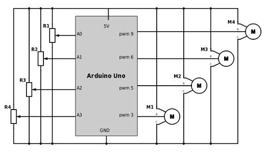

A 4 servo robotic arm implementation.

[//]: # (This may be the most platform independent comment)

##What it's for
Mainly to test a 3D printer I got as a present. 

##How to build
The instructions are on [http://www.instructables.com/id/EEZYbotARM/](http://www.instructables.com/id/EEZYbotARM/)
To build you need:

* Access to a 3D printer and about 5-15 hours print time. [Print files](http://www.thingiverse.com/thing:1015238)
* 4 tower-pro 12g metal gear servo motors or 9g servo motors.
* A selection of 3M and 4M nuts(self-locking and normal), washers and bolts.
* A tube of 3mm diameter cuttable to length, preferably a metal pipe, however I just used a piece of plastic from a pen. 
* A Microcontroller with PWM and analog capabilities or using some kind of motor driver board if controlling it another way.

All credit for this goes to the designers of the arm and maker of the instructable. 

#### Note

It's very similiar to the [Mii Arm](http://www.thingiverse.com/thing:1015238). Following weblinks gives a few idea of making it work with old Nokia screens and joysticks.

##Electronics and code

Decided to make my own custom PCB stripboard circuit with a soldering iron and female headers. 

> 

A schematic diagram of the circuit with Arduino is as follows

> 

And a physical layout of the circuit is shown below.

> .png)

And the Arduino code can be found in the [4potControl](4potControl/) folder.
